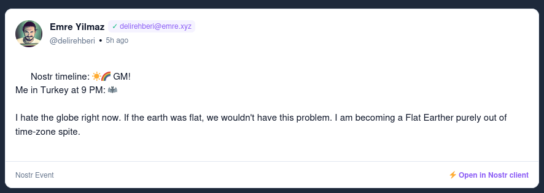
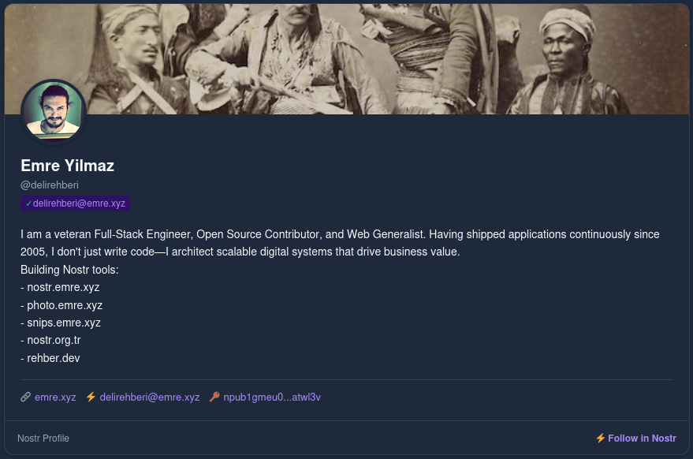
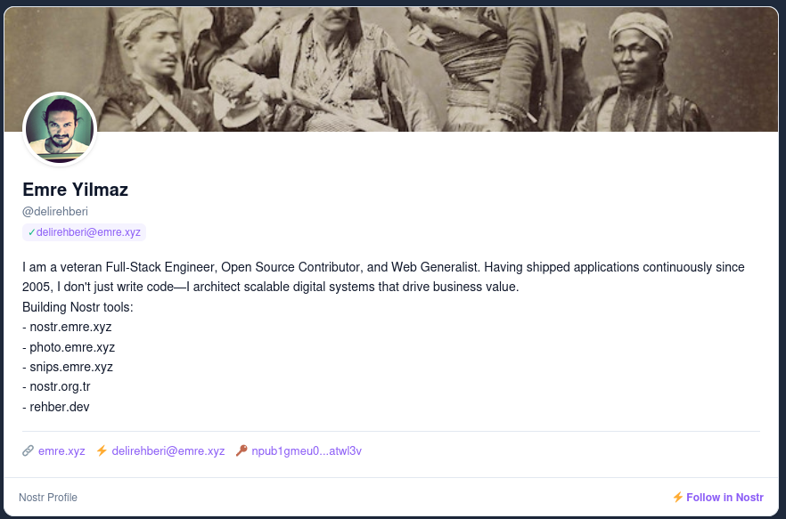
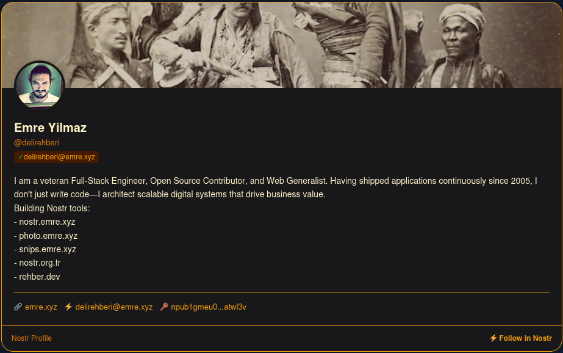

# @nostr-org-tr/nostr-event-dom

[](https://www.npmjs.com/package/@nostr-org-tr/nostr-event-dom)
[](https://github.com/Nostr-org-tr/nostr-event-dom/blob/main/LICENSE)

A lightweight, zero-config Web Component (`<nostr-event>`) to embed and render Nostr events across any website or application.

Inspired by [`<mastodon-post>`](https://github.com/daviddarnes/mastodon-post), `<nostr-event>` provides progressive enhancement, automatic relay resolution, safe content sanitization, and full CSS customizability without requiring complex template markup.

---

## 📸 Screenshots & Previews

| Light Note (Kind 1) | Dark Profile (Kind 0) |
| :---: | :---: |
|  |  |

| Light Profile (Kind 0) | Custom Styled Profile |
| :---: | :---: |
|  |  |

---

## ✨ Features

- **Progressive Enhancement**: Drop a regular `<a>` link to a Nostr note/profile inside `<nostr-event>` and it automatically hydrates in JavaScript-enabled browsers while remaining indexable by search engines.
- **Multiple Event Kinds Supported**:
  - **Kind 0 (Profile)**: Avatar, banner, name, display name, NIP-05 badge, bio, website, Lightning address (lud16).
  - **Kind 1 (Text Note)**: Rich parsed notes with autolinked URLs, hashtags, NIP-21 `nostr:` mentions, and inline image/video embeds.
  - **Kind 30023 (Long-form Article / NIP-23)**: Rich markdown typography, cover images, summaries, and topic tags.
  - **Kind 31922 / 31923 (Calendar Event / NIP-52)**: Time/date-based events, location details, organizer metadata.
  - **Kind 20 / 21 / 22 / 1063 / 34235 / 34236 (Media / NIP-68 / NIP-71)**: Native photo viewers, 16:9 responsive video players, 9:16 vertical short videos, and file metadata.
  - **Generic Fallback**: Clean card rendering for any other kind with an expandable raw JSON viewer.
- **Relay Resolution & In-Memory Caching**: Fetches from default relays (`wss://purplepag.es`, `wss://relay.damus.io`, `wss://nos.lol`, `wss://relay.primal.net`, `wss://nostr.mom`) or custom relays specified via `relays="..."`.
- **Security First**: Strict HTML sanitization to prevent XSS attacks; verifies safe protocols (`https:`, `http:`, `nostr:`, `web+nostr:`, `lightning:`, `mailto:`, `magnet:`) and escapes malicious attributes.
- **CSS Variable Theming & `::part()`**: Full design control via CSS custom properties and Shadow DOM `::part` selectors without needing custom HTML templates.

---

## 🚀 Quick Start

### 1. Include via CDN / Script Tag

```html
<!-- Standalone Script (Works offline & online) -->
<script src="https://cdn.jsdelivr.net/npm/@nostr-org-tr/nostr-event-dom/dist/nostr-event.global.js"></script>

<!-- Or via unpkg -->
<!-- <script src="https://unpkg.com/@nostr-org-tr/nostr-event-dom/dist/nostr-event.global.js"></script> -->

<!-- Or ES Module via esm.sh -->
<!-- <script type="module" src="https://esm.sh/@nostr-org-tr/nostr-event-dom"></script> -->

<!-- Profile via NIP-05 -->
<nostr-event event="fiatjaf@fiatjaf.com"></nostr-event>

<!-- Profile via npub -->
<nostr-event event="npub180cvv07tjdrrgpa0j7j7tmnyl2yr6yr7l8j4s3evf6u64th6gkwsyjh6w6"></nostr-event>

<!-- Note via note1 or nevent1 -->
<nostr-event event="note1..."></nostr-event>

<!-- Long-form Article via naddr1 -->
<nostr-event event="naddr1..."></nostr-event>
```

### 2. Direct JSON / Offline & SSR Hydration

Pass pre-fetched Nostr event JSON directly to render instantly without hitting relays:

```html
<!-- Via HTML attribute (escaped JSON string) -->
<nostr-event event='{"id":"...","pubkey":"...","created_at":1700000000,"kind":1,"tags":[],"content":"Hello nostr!","sig":"..."}'></nostr-event>
```

```javascript
// Or assign directly to the DOM element property in JavaScript/TypeScript
const el = document.querySelector('nostr-event');
el.event = rawNostrEventObject;
```

### 3. Progressive Enhancement (Fallback Links)

```html
<script src="https://cdn.jsdelivr.net/npm/@nostr-org-tr/nostr-event-dom/dist/nostr-event.global.js"></script>

<nostr-event>
  <a href="nostr:npub180cvv07tjdrrgpa0j7j7tmnyl2yr6yr7l8j4s3evf6u64th6gkwsyjh6w6">
    View fiatjaf on Nostr
  </a>
</nostr-event>
```

### 4. Install via npm / yarn / pnpm

```bash
npm install @nostr-org-tr/nostr-event-dom
```

```javascript
import '@nostr-org-tr/nostr-event-dom';
```

---

## ⚙️ Attributes & Properties

### HTML Attributes

| Attribute | Type | Description | Default |
| :--- | :--- | :--- | :--- |
| `event` | `string` | Nostr identifier (`note1...`, `nevent1...`, `npub1...`, `nprofile1...`, `naddr1...`, `name@domain.com`, hex ID) **OR** serialized raw Nostr Event JSON string. | `null` |
| `src` | `string` | Alias for Nostr URI or bech32 identifier (`nostr:note1...`, `nevent1...`, etc.). | `null` |
| `relays` | `string` | Comma-separated list of custom WebSocket relay URLs. | Built-in defaults |
| `theme` | `light` \| `dark` \| `auto` | Color theme mode. | `auto` (system preference) |
| `hide-author` | `boolean` | Hides the author header block. | `false` |
| `hide-media` | `boolean` | Hides inline image/video embeds in notes. | `false` |

### JavaScript Properties & Methods

| Property / Method | Type | Description |
| :--- | :--- | :--- |
| `el.event` | `NostrEvent \| null` | Getter/setter for the underlying Nostr event object. Setting this triggers immediate rendering. |
| `el.authorProfile` | `NostrProfile \| null` | Getter/setter for the author profile metadata (Kind 0). |
| `el.src` | `string \| null` | Getter/setter reflecting the `src` attribute. |
| `el.relays` | `string[]` | Getter/setter reflecting configured relay URLs as an array. |
| `el.load()` | `() => Promise<void>` | Programmatically triggers event fetching and rendering. |

### Custom Events

| Event | `event.detail` | Description |
| :--- | :--- | :--- |
| `nostr-load` | `{ event: NostrEvent }` | Dispatched when the Nostr event has successfully loaded and rendered. |
| `nostr-error` | `{ error: string }` | Dispatched when event fetching or decoding fails. |

---

## 🎨 Styling & CSS Customization

You can customize `<nostr-event>` using CSS Custom Properties or Shadow DOM `::part()` selectors without needing custom HTML templates:

### CSS Custom Properties

| Custom Property | Description | Default (Light / Dark) |
| :--- | :--- | :--- |
| `--ne-bg` | Component host background | `#ffffff` / `#0f172a` |
| `--ne-card-bg` | Main card background color | `#ffffff` / `#1e293b` |
| `--ne-text` | Primary body and heading text color | `#0f172a` / `#f8fafc` |
| `--ne-text-muted` | Secondary / metadata text color | `#64748b` / `#94a3b8` |
| `--ne-border` | Border color for cards, dividers, and chips | `#e2e8f0` / `#334155` |
| `--ne-accent` | Primary brand/accent color (links, highlights) | `#8b5cf6` / `#a78bfa` |
| `--ne-accent-hover` | Hover color for links and accent buttons | `#7c3aed` / `#c4b5fd` |
| `--ne-accent-light` | Subtle accent tint background for badges/quotes | `#f5f3ff` / `#2e1065` |
| `--ne-code-bg` | Background color for code blocks and event details | `#f1f5f9` / `#0f172a` |
| `--ne-badge-bg` | Background color for badges and chips | `#f1f5f9` / `#334155` |
| `--ne-radius` | Card border radius | `12px` |
| `--ne-radius-sm` | Small border radius for media, badges, and avatars | `6px` |
| `--ne-avatar-size` | Diameter of author avatar | `44px` |
| `--ne-font-sans` | Sans-serif typography stack | `-apple-system, BlinkMacSystemFont, ...` |
| `--ne-font-mono` | Monospace typography stack | `ui-monospace, SFMono-Regular, ...` |
| `--ne-shadow` | Card drop shadow | `0 1px 3px 0 rgb(0 0 0 / 0.1)` |

#### Example Theme Override

```css
nostr-event.custom-theme {
  --ne-card-bg: #18181b;
  --ne-border: #3f3f46;
  --ne-text: #f4f4f5;
  --ne-text-muted: #a1a1aa;
  --ne-accent: #f59e0b;
  --ne-accent-hover: #d97706;
  --ne-accent-light: #451a03;
  --ne-radius: 16px;
  --ne-font-sans: "Inter", sans-serif;
  --ne-font-mono: "Fira Code", monospace;
}
```

### Available `::part()` Shadow DOM Selectors

#### General & Structural
- `::part(card)`: Outer card container across all event kinds
- `::part(body)` / `::part(content)`: Main content container
- `::part(footer)`: Card footer section
- `::part(protocol-link)`: "Open in Nostr" action link in the footer
- `::part(loading)`: Loading state indicator container
- `::part(error)`: Error state message container

#### Author & Header
- `::part(header)`: Author header section
- `::part(avatar-wrap)`: Circular avatar wrapper
- `::part(avatar)`: Avatar image element
- `::part(avatar-fallback)`: Initial-letter avatar fallback badge
- `::part(avatar-link)`: Clickable avatar link
- `::part(author-meta)`: Author names and metadata block
- `::part(name)`: Author display name
- `::part(nip05)`: NIP-05 verification badge wrapper
- `::part(handle)`: Secondary author handle
- `::part(time)`: Relative publication timestamp link

#### Content & Inline Elements
- `::part(link)`: Standard hyperlinked URLs
- `::part(mention)`: NIP-21 `nostr:` mention links
- `::part(hashtag)`: Clickable `#hashtag` search links
- `::part(code-inline)`: Inline `<code>` snippet
- `::part(code-block)`: Multi-line `<pre><code>` block
- `::part(media-embed)`: Container for inline note image/video embeds
- `::part(media-image)`: Inline image element within notes
- `::part(media-video)`: Inline video player element within notes
- `::part(media-audio)`: Inline audio player element within notes

#### Profile Kind (Kind 0)
- `::part(profile-card)`: Profile card container
- `::part(banner)`: Profile banner header
- `::part(profile-avatar)`: Large profile avatar image
- `::part(profile-name)`: Profile display name header
- `::part(profile-about)`: Profile bio description
- `::part(profile-extra)`: Extra metadata list (website, Lightning address)

#### Long-Form Article Kind (Kind 30023)
- `::part(article-card)`: Article card container
- `::part(article-cover)`: Hero cover image
- `::part(article-header)`: Article title and summary section
- `::part(article-title)`: Main article heading
- `::part(article-summary)`: Article summary paragraph
- `::part(article-body)`: Article formatted markdown content
- `::part(article-tags)`: List of article topic tags
- `::part(heading)`: Subheadings within markdown
- `::part(paragraph)`: Paragraph elements
- `::part(blockquote)`: Blockquote elements
- `::part(list)`: Bulleted lists

#### Media Kinds (Kind 20, 21, 22, 1063, 34235, 34236)
- `::part(media-card)`: Media card container
- `::part(short-card)`: Vertical short-video card modifier
- `::part(photo-wrap)` / `::part(photo)`: Full-width photo viewer
- `::part(video-wrap)` / `::part(video)`: 16:9 responsive video player
- `::part(short-wrap)` / `::part(short-video)`: 9:16 vertical short-video player
- `::part(media-meta)`: Media title and description wrapper
- `::part(media-title)`: Media title heading

#### Calendar Kinds (Kind 31922, 31923)
- `::part(calendar-card)`: Calendar event card container
- `::part(badge)`: Calendar category badge
- `::part(event-cover)`: Event header cover image
- `::part(title)`: Event title
- `::part(details)`: Date, time, and location details grid
- `::part(description)`: Calendar event description body

#### Generic Fallback
- `::part(fallback-card)`: Generic card for unsupported kinds
- `::part(kind-badge)`: Kind number badge chip
- `::part(raw-details)` / `::part(raw-json)`: Expandable raw JSON inspector

#### Example: CSS Part Styling

```css
nostr-event::part(card) {
  box-shadow: 0 10px 25px -5px rgba(0, 0, 0, 0.2);
}

nostr-event::part(name) {
  font-size: 1.1rem;
}

nostr-event::part(nip05) {
  font-weight: 600;
}
```

---

## 🛠️ Development & Building

```bash
# Install dependencies
make install

# Start local dev server with demo
make dev

# Run unit tests
make test

# Build production bundle
make build
```

---

## 📄 License
 
MIT © [nostr.org.tr community](https://github.com/Nostr-org-tr)
